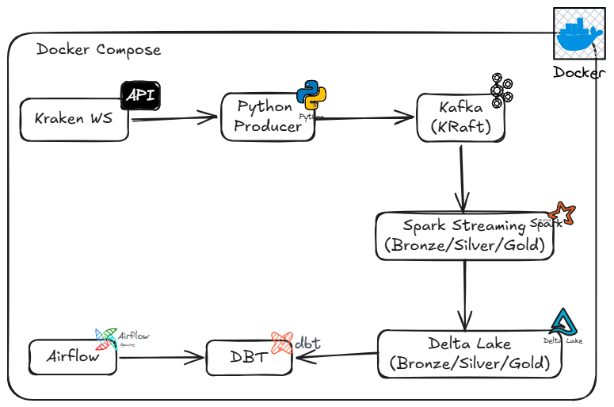
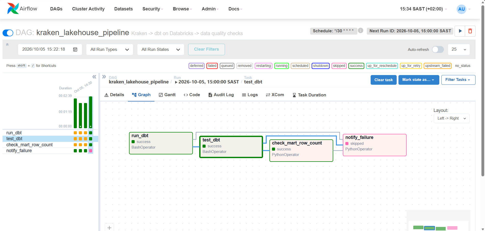
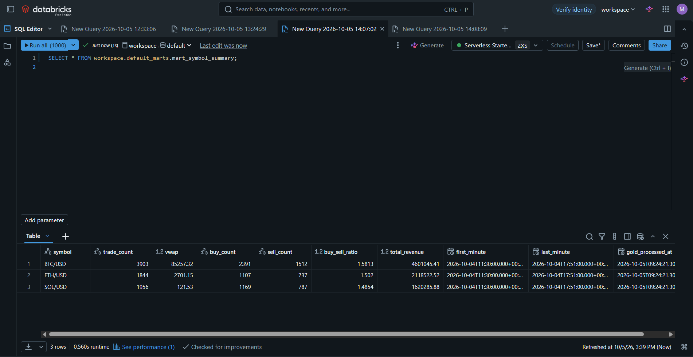

# Real-Time Streaming Lakehouse

[](https://github.com/mongezi-ls/real-time-streaming-lakehouse/actions/workflows/ci.yml)

End-to-end streaming data platform: **Kraken WebSocket → Kafka → PySpark Structured Streaming → Delta Lake → dbt on Databricks → Airflow**, fully Dockerized and CI-tested.



## Why This Project

Most portfolio projects are batch-only or stop at "Spark writes Parquet." This one is a complete **real-time lakehouse** with:

- **Push-based ingestion** from a live WebSocket feed (Kraken crypto trades)
- **Medallion architecture** (Bronze → Silver → Gold) on Delta Lake with exactly-once semantics
- **Watermarks + MERGE** for late-arriving data and idempotent upserts
- **dbt on Databricks** with 5 models, 9 data quality tests, and lineage
- **Airflow orchestration** running every 30 minutes
- **29 pytest unit tests** + ruff linting, enforced in GitHub Actions CI

## Architecture

```
Kraken WebSocket API (wss://ws.kraken.com/v2)
        │
        │  live trade events (JSON)
        ▼
Python Producer (ingestion/kraken_producer.py)
        │
        │  publishes to Kafka topic: kraken.trades
        ▼
Kafka 3.7 (KRaft mode, Docker)
        │
        │  Structured Streaming, 10s trigger
        ▼
Bronze Delta  (data/bronze/kraken_trades)   — raw JSON + parsed fields
        │
        │  explode, cast, dedupe, watermark
        ▼
Silver Delta  (data/silver/kraken_trades)   — clean, typed, one row per trade
        │
        │  aggregations
        ▼
Gold Delta    (data/gold/revenue_per_minute, symbol_metrics, top_trades)
        │
        │  uploaded to Unity Catalog Volume
        ▼
Databricks
        │
        │  dbt run + dbt test (staging views + mart tables)
        ▼
dbt marts     (workspace.default_marts.*)
        │
        │  orchestrated by
        ▼
Airflow       (DAG every 30 minutes: dbt run → dbt test → mart row count check)
```

## Tech Stack

| Layer | Tool |
|---|---|
| Ingestion | Python 3.11, Kraken WebSocket v2, confluent-kafka |
| Streaming | PySpark Structured Streaming 3.5.1 |
| Storage | Delta Lake 3.1.0 (Bronze / Silver / Gold) |
| Cloud | Databricks (Free Edition), Unity Catalog Volume |
| Transform | dbt Core 1.7.0 + dbt-databricks |
| Orchestration | Apache Airflow 2.9 (LocalExecutor) |
| Infra | Docker + Docker Compose |
| Quality | pytest 8.2, ruff 0.4 |
| CI/CD | GitHub Actions (lint, tests, dbt parse) |

## Project Structure

```
real-time-streaming-lakehouse/
├── ingestion/                      # Kraken WebSocket → Kafka
│   ├── kraken_producer.py
│   └── consumer_check.py
├── streaming/                      # PySpark Structured Streaming
│   ├── bronze_stream.py            # Kafka → Bronze Delta
│   ├── silver_stream.py            # Bronze → Silver (dedupe + watermark)
│   ├── gold_stream.py              # Silver → Gold (aggregations)
│   ├── inspect_bronze.py
│   ├── inspect_silver.py
│   ├── inspect_gold.py
│   ├── inspect_delta_features.py
│   └── optimize_tables.py
├── transform/
│   └── kraken_analytics/           # dbt project
│       ├── dbt_project.yml
│       └── models/
│           ├── staging/            # stg_silver_trades, stg_gold_*
│           └── marts/              # mart_symbol_summary, mart_hourly_volume
├── orchestration/                  # Airflow
│   ├── kraken_pipeline_dag.py
│   └── _init_connections.py
├── docker/                         # Docker Compose + Airflow image
│   ├── docker-compose.yml
│   └── airflow/
│       ├── Dockerfile
│       └── requirements.txt
├── tests/                          # pytest unit tests (29)
│   ├── conftest.py
│   ├── test_kraken_producer.py
│   ├── test_silver_logic.py
│   └── test_dbt_project.py
├── ci/
│   └── profiles.yml                # CI-only dbt profile
├── docs/                           # Diagram + screenshots
│   ├── architecture.png
│   ├── airflow-dag-green.png
│   ├── airflow-ui.png
│   └── databricks-mart.png
├── .github/workflows/ci.yml        # GitHub Actions
├── requirements.txt
├── ruff.toml
├── Makefile
└── README.md
```

## Quick Start

### Prerequisites

- Docker Desktop (with WSL2 backend on Windows)
- Python 3.11
- Java 17 (Eclipse Temurin)
- ~8 GB RAM recommended

### Setup

```bash
git clone https://github.com/mongezi-ls/real-time-streaming-lakehouse.git
cd real-time-streaming-lakehouse
cp .env.example .env              # then edit .env with your Databricks token
py -3.11 -m venv .venv
.venv\Scripts\Activate.ps1        # Windows
pip install -r requirements.txt
```

### Run the pipeline

```powershell
# Terminal 1: bring up Kafka + Postgres + Airflow
docker compose -f docker/docker-compose.yml up -d

# Terminal 2: Kraken → Kafka
python ingestion/kraken_producer.py

# Terminal 3: Kafka → Bronze Delta
python streaming/bronze_stream.py

# Terminal 4: Bronze → Silver Delta
python streaming/silver_stream.py
```

### Run the analytics layer

```powershell
python streaming/gold_stream.py
cd transform/kraken_analytics
dbt run
dbt test
```

### Airflow UI

Open `http://localhost:8080` — user `admin`, password `admin`.

## Screenshots

### Airflow DAG — successful run



### Databricks mart table



## Key Design Decisions

| Decision | Rationale |
|---|---|
| **Kafka in KRaft mode** | No Zookeeper dependency — fewer moving parts |
| **Dual Kafka listeners** (`kafka:9092` / `localhost:29092`) | Containers use internal hostname, host tools use localhost |
| **Delta MERGE for Silver** | Idempotent upserts — replaying a batch never duplicates trades |
| **2-minute watermark on event_ts** | Bounds state, handles late Kraken events |
| **Batch Gold (not streaming)** | CPU-efficient on an 8 GB host; Delta's freshness makes it feel real-time |
| **dbt on Databricks, PySpark on host** | Cloud-side work is orchestrated; heavy Spark runs locally to save container RAM |
| **Read Unity Catalog Volume paths directly** | Unity Catalog won't allow external tables on `dbfs:/Volumes/...` paths |
| **Pin dbt-core == dbt-adapter** | Version match required — mixed versions break the plugin loader |

## Data Quality

- **29 pytest unit tests** — event filtering, subscription format, schema contract, VWAP/notional math, dbt project structure
- **9 dbt tests** — `unique`, `not_null`, `accepted_values` on key columns
- **Airflow mart row count check** — fails the DAG if the mart is empty
- **CI on every push** — lint, tests, and dbt parse

## License

MIT