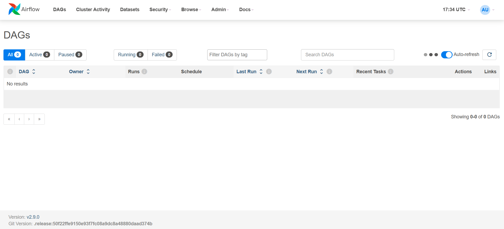

# Real-Time Streaming Lakehouse

End-to-end streaming data platform: **Kafka → PySpark Structured Streaming → Delta Lake → dbt → Airflow**, fully Dockerized.


## What Happens In This Project

In this project I will build and operate a **real-time lakehouse** with:

- Push-based event ingestion from a live WebSocket feed (Kraken crypto trades)
- Medallion architecture (Bronze → Silver → Gold) on Delta Lake
- Streaming aggregations with watermarks + late-data handling
- dbt transformations + tests on top of Delta
- Airflow orchestration for backfills, dbt runs, and alerting
- CI/CD with linting + unit tests + dbt tests

## Tech Stack

| Layer | Tool |
|---|---|
| Ingestion | Python + Kraken WebSocket + confluent-kafka |
| Streaming | PySpark Structured Streaming |
| Storage | Delta Lake |
| Transform | dbt (dbt-databricks / dbt-spark) |
| Orchestration | Airflow |
| Infra | Docker + Docker Compose |
| CI/CD | GitHub Actions + pytest + ruff |


## Project Structure

```
.
├── ingestion/         # Kafka producer (Kraken WebSocket)
├── streaming/         # PySpark Structured Streaming jobs
├── transform/         # dbt project (staging + marts)
├── orchestration/     # Airflow DAGs
├── docker/            # docker-compose + Dockerfiles
├── docs/              # architecture diagram + screenshots
├── tests/             # pytest unit tests
└── .github/workflows/ # CI/CD
```

## License

MIT

## Screenshots

### Airflow UI

